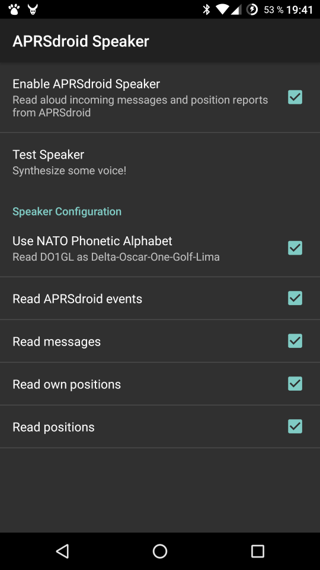

# APRSdroid Speaker

This is an example project to illustrate how [APRSdoid](https://aprsdroid.org/)'s
[Inter-App API](https://aprsdroid.org/api/) can be used. It is also a
functional app that will read out loud APRSdroid's events, stations and
messages.

## Features

* English only
* Tells you when APRSdroid is started/stopped
* Announces sent positions
* Announces received stations with distance and direction
* Reads aloud incoming messages
* Tells you when APRSdroid's TNC connection is interrupted (requires APRSdroid 1.4+)

## Screenshot

